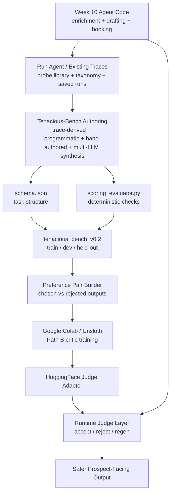
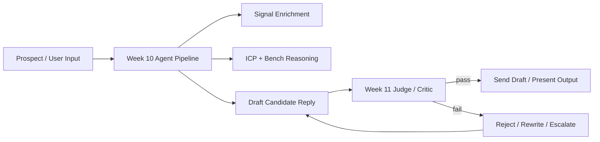

# SalesConversion-Bench

This repo is the Week 11 evaluation-and-training layer built on top of the Week 10 Tenacious sales agent work.

## Public artifacts (final submission)

| Artifact | URL |
|----------|-----|
| Technical blog post | [dev.to — When generic benchmarks fail…](https://dev.to/natnael_alemseged/when-generic-benchmarks-fail-building-a-sales-domain-evaluation-bench-from-scratch-1kjf) |
| Dataset (HF) | [Natnaela/tenacious-bench](https://huggingface.co/datasets/Natnaela/tenacious-bench) |
| Path B LoRA judge | [Natnaela/tenacious-judge-lora](https://huggingface.co/Natnaela/tenacious-judge-lora) |
| Community (τ²-Bench gap) | [Issue #293](https://github.com/sierra-research/tau2-bench/issues/293) |

Demo video (required for final submit): host on YouTube (unlisted is fine) or Loom and add the link in your submission form — it is not stored in this repo.

## Quickstart: Reproduce the Headline Number

Use this path to reproduce Delta A, the paired-bootstrap comparison behind the headline `+76.6` percentage point lift and `91.5%` trained preference accuracy result.

1. Install dependencies:

```bash
pip install -r requirements.txt
```

2. Confirm the held-out task file and trained preference margins file are present:

```bash
test -f tenacious_bench_v0.2/held_out/tasks.jsonl
test -f ablations/held_out_preference_margins.jsonl
```

3. Run the paired bootstrap:

```bash
python3 ablations/paired_bootstrap_delta_a.py --seed 42 --bootstrap 50000
```

Successful reproduction should report the same held-out headline numbers already committed in this repo: trained preference accuracy `43/47 = 91.5%`, deterministic baseline preference accuracy `7/47 = 14.9%`, paired lift `+76.6pp`, and one-sided exact paired binomial/McNemar `p = 0.000000000015`. The script also writes the same summary to `ablations/significance_test.txt`.

The short version:

- **Week 10** built an agent that gathers public signals, classifies the prospect, drafts outreach/replies, and books discovery calls.
- **Week 11** is about proving whether that agent behaves correctly for Tenacious, then training a small **critic/judge** to catch bad outputs before they ship.

## Setup

Environment requirements:

- Python `3.12+`
- local Python packages from `requirements.txt`
- optional scientific/NLP extras from `pyproject.toml` for deeper contamination or training work

Key dependencies used by the main repo workflows:

- `streamlit` for the human grading UI
- `jsonschema`-style validation tooling through the local scripts
- `sentence-transformers` as the pinned contamination backend when available

Install command:

```bash
pip install -r requirements.txt
```

Sample evaluator invocation:

```bash
python3 scoring_evaluator.py --task-file tenacious_bench_v0.2/train/tasks.jsonl
```

## What This Project Is Trying To Do

The aim is **not** just to polish the Week 10 agent’s wording.

The aim is to build a system that can answer:

1. Does the Week 10 agent follow Tenacious business rules?
2. Can we measure that with a domain-specific benchmark instead of a generic benchmark?
3. Can we train a small Path B critic/judge that rejects bad drafts and improves reliability?

So the flow is:

- inspect the Week 10 agent and its failures
- build a Tenacious-specific evaluation dataset
- build a machine-checkable evaluator
- convert failures into preference data
- train a small critic/judge
- use that critic in front of the Week 10 generator

## The Core Idea

The Week 10 agent already has useful business logic:

- enrichment pipeline for funding, layoffs, leadership, AI maturity, and bench matching
- outbound/reply drafting logic
- booking / routing logic

But Week 10 evidence shows it still makes high-cost mistakes:

- promising staffing capacity the bench does not support
- picking the wrong ICP segment
- making weakly grounded claims
- sending the booking CTA too early

Week 11 adds a **benchmark plus judge layer** so the generator is no longer trusted by default.

## Do I Refine The Week 10 Agent Code And Run It?

Yes, but that is only one part of the system.

Think of the project as having **three layers**:

1. **Week 10 agent layer**
   - existing source in `week_10_data/agent/`
   - this is the thing that produces candidate outputs

2. **Week 11 benchmark layer**
   - `schema.json`
   - `scoring_evaluator.py`
   - `tenacious_bench_v0.2/`
   - this is the thing that measures whether outputs are acceptable

3. **Week 11 judge-training layer**
   - later `training_data/`
   - Colab / Unsloth notebook runs
   - HuggingFace adapter upload
   - this is the thing that learns to score/reject better than rules alone

So yes, you may refine the Week 10 agent code, but the Week 11 deliverable is broader:

- **measure** the Week 10 agent
- **capture** its failures as data
- **train** a judge on that data
- **insert** the judge back into the runtime loop

## Where Google Colab / The Notebook Fits

The notebook is **not** the main application runtime.

It is the **training workstation** for the Path B critic.

Use Colab for:

1. loading the preference dataset you build from Week 10 failures
2. running a small LoRA fine-tune with Unsloth or TRL
3. evaluating the trained judge on dev / held-out slices
4. pushing the adapter to HuggingFace

Do **not** think of Colab as the place where the whole sales agent lives.

The runtime architecture is local repo code plus later hosted artifacts:

- local repo: benchmark generation, evaluator, data prep
- Colab: cheap GPU training job
- HuggingFace: publish dataset + judge adapter
- local repo again: integrate the trained judge into the inference loop

## End-To-End Architecture



## Runtime Architecture

This is the production-ish shape you are aiming for after Week 11:



## What Each Piece In This Repo Is For

### Week 10 evidence and agent

- [week_10_data/failure_taxonomy.md](week_10_data/failure_taxonomy.md) - Week 10 failure categories, trigger rates, and severity rollups.
- [week_10_data/probe_library.md](week_10_data/probe_library.md) - Probe-by-probe failure descriptions with Tenacious trace refs.
- [week_10_data/trace_log.jsonl](week_10_data/trace_log.jsonl) - Retail benchmark run ledger used to show benchmark mismatch.
- [week_10_data/agent](week_10_data/agent) - The Week 10 Tenacious agent code reused for business-rule grounding.

Purpose:

- evidence about where the existing system fails
- source code to reuse for real business rules and constraints

### Act I benchmark scaffold

- [methodology.md](methodology.md) - Path selection, evidence limits, and contamination rationale.
- [audit_memo.md](audit_memo.md) - Why retail benchmarks miss Tenacious-specific failure modes.
- [schema.json](schema.json) - Machine-verifiable task schema plus example tasks.
- [scoring_evaluator.py](scoring_evaluator.py) - Deterministic scorer and judge hook contract.
- [ACT_I_IMPLEMENTATION_NOTES.md](ACT_I_IMPLEMENTATION_NOTES.md) - Narrative notes about the Act I build decisions.
- [tenacious_bench_v0.1](tenacious_bench_v0.1) - Original 60-task Act I benchmark slice.
- [tenacious_bench_v0.2](tenacious_bench_v0.2) - Current 240-task benchmark slice used by the main docs.
- [generation_scripts](generation_scripts) - Build, validate, split, contamination, routing, and judge-filter tooling.
- [contamination_check.json](contamination_check.json) - Contamination results for v0.1.
- [contamination_check.v0.2.json](contamination_check.v0.2.json) - Current contamination results for v0.2.

Purpose:

- define what a Tenacious task looks like
- define how tasks get scored
- create the first working evaluator
- create a real benchmark slice and partition it reproducibly

### Training setup

- [tenacious_path_b_simpo_colab.ipynb](tenacious_path_b_simpo_colab.ipynb) - Colab notebook for Path B SimPO LoRA judge training.
- [training/train_simpo.py](training/train_simpo.py) - Source-controlled training script with explicit SimPO, LoRA, seed, scheduler, and immutable backbone revision pinning.
- [pyproject.toml](pyproject.toml) - Python project metadata and tool configuration.
- [requirements.txt](requirements.txt) - Lightweight dependency list for local scripts and UI.
- [cost_log.csv](cost_log.csv) - Spend log placeholder for training and API work.

The committed Path B run intentionally uses the text-only fallback `unsloth/Qwen2.5-0.5B-Instruct` at revision `ae616882a38b36759fc46ac3fd6769498833b913` because the target Qwen 3.5 Colab path was multimodal and unstable for text-only SimPO preference training. The resulting wall time is about `2.16` minutes, which is below the rubric's `30–90` minute target because the run trains on only `81` train pairs and `10` eval pairs.

**After a Colab run:** the notebook writes artifacts under `training_artifacts/` in the Colab session (not in this repo by default). Download or copy them into the repo’s `training/` folder so final submission paths resolve:

- `training/training_run.log`
- `training/trainer_log_history.jsonl`
- `training/loss_curve.png`
- `training/eval_preference_margin.json`

The `training/` directory is the canonical location for `evidence_graph.json`, `FINAL_SUBMISSION_TASKS.md`, and other final-submission evidence files.

Purpose:

- make the environment ready for low-cost LoRA training
- record compute / API spend

## Current Artifact Status

Current dataset artifacts on disk:

- `tenacious_bench_v0.1/train/tasks.jsonl`: 29 tasks
- `tenacious_bench_v0.1/dev/tasks.jsonl`: 18 tasks
- `tenacious_bench_v0.1/held_out/tasks.jsonl`: 13 tasks
- `tenacious_bench_v0.2/train/tasks.jsonl`: 120 tasks
- `tenacious_bench_v0.2/dev/tasks.jsonl`: 73 tasks
- `tenacious_bench_v0.2/held_out/tasks.jsonl`: 47 tasks

Current source-mode counts from `generation_scripts/counts.json`:

- `trace_derived`: 72
- `programmatic`: 72
- `multi_llm_synthesis`: 60
- `hand_authored`: 36

Current failure-category counts:

- `bench_overcommitment`: 48
- `dual_control_coordination`: 35
- `gap_overclaiming`: 44
- `icp_misclassification`: 39
- `signal_overclaiming`: 35
- `tone_drift`: 39

Core repo commands:

```bash
python3 generation_scripts/build_probe_tasks.py
python3 generation_scripts/validate_schema.py tenacious_bench_v0.2/source_pool.jsonl
python3 generation_scripts/dedup.py tenacious_bench_v0.2/source_pool.jsonl
python3 generation_scripts/build_dataset.py --source-pool tenacious_bench_v0.2/source_pool.jsonl
python3 generation_scripts/split_dataset.py tenacious_bench_v0.2/source_pool.jsonl --seed 20260429 --out-root tenacious_bench_v0.2
python3 generation_scripts/summarize_dataset.py
python3 generation_scripts/contamination_check.py
python3 scoring_evaluator.py --task-file tenacious_bench_v0.2/train/tasks.jsonl
```

## Evaluator examples (end-to-end)

The evaluator is designed to be inspectable end-to-end with **committed example tasks**:

- `schema.json` includes **3 concrete example tasks** under the `examples` field
- `scoring_evaluator.py` can score those examples directly

Run the evaluator on the committed `schema.json` examples:

```bash
python3 scoring_evaluator.py --schema schema.json
```

You can also inspect pre-exported evaluator outputs in `eval_examples/` (see `eval_examples/README.md`).

## Human grading UI (Pass 1 / Pass 2)

If you want the simplest way to do the required human grading passes (PASS/FAIL per check), use the local Streamlit UI:

```bash
pip install -r requirements.txt
streamlit run grading_ui/app.py
```

What it does:

- loads tasks from `eval_examples/` (small subset) or `tenacious_bench_v0.2/*/tasks.jsonl`
- shows the candidate email (subject/body) plus signal + bench context
- lets you click PASS/FAIL per required check
- autosaves your labels to `human_labels/pass1_labels.json` (editable in the sidebar)

## Follow-On Work After Final Submission

### 1. Reporting extensions

Supporting docs that can still be extended:

- `inter_rater_agreement.md`
- `interim_report.md` (archival write-up from the build process)
- finalize the common-reading memos in `synthesis_memos/`

### 2. Evaluator expansion

Add checks for:

- competitor-gap source support
- thread leakage
- confidence-aware phrasing
- stronger CTA / stage gating

### 3. Preference-data expansion

Create preference pairs:

- **rejected** = bad outputs from probes or failed drafts
- **chosen** = corrected outputs that pass evaluator checks

### 4. Additional Colab experiments

In Colab:

- load preference data
- fine-tune a small judge model with LoRA
- export the adapter
- evaluate it on the benchmark dev set

### 5. Runtime integration hardening

At runtime:

- generator drafts
- judge scores
- if score fails, regenerate or escalate

## A Practical Mental Model

If you want the simplest way to remember the whole system:

- **Week 10 agent** = "writer"
- **Week 11 benchmark** = "exam"
- **Week 11 Path B critic** = "reviewer"
- **Colab notebook** = "training shop for the reviewer"

The writer already exists.
This project builds the exam and trains the reviewer.

## Attribution and Credits

Project author: Natnael Alemseged.

Tenacious-Bench was motivated by the Tenacious company’s Week 10 failure library, which supplied the commercial failure patterns that this benchmark formalizes into auditable tasks.

Methodology was informed by five papers:

- SimPO: Meng, Xia, and Chen, *SimPO: Simple Preference Optimization with a Reference-Free Reward*
- ORPO: Hong, Lee, and Thorne, *ORPO: Monolithic Preference Optimization without Reference Model*
- DPO: Rafailov et al., *Direct Preference Optimization*
- Prometheus 2: Kim et al., *Prometheus 2: An Open-Source Language Model Specialized in Evaluating Other Language Models*
- Preference leakage: Li et al., *Preference Leakage: A Contamination Problem in LLM-as-a-Judge*

Open-source tools used throughout the build and release flow include Unsloth, TRL, `sentence-transformers`, and Hugging Face Datasets.
