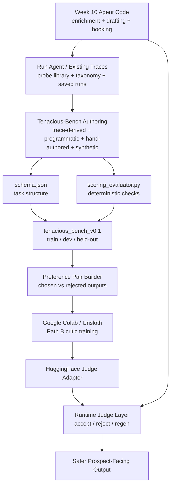
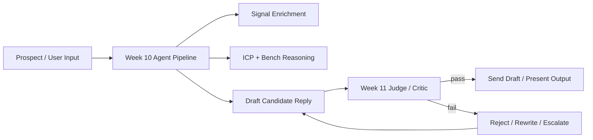

# SalesConversion-Bench

This repo is the Week 11 evaluation-and-training layer built on top of the Week 10 Tenacious sales agent work.

The short version:

- **Week 10** built an agent that gathers public signals, classifies the prospect, drafts outreach/replies, and books discovery calls.
- **Week 11** is about proving whether that agent behaves correctly for Tenacious, then training a small **critic/judge** to catch bad outputs before they ship.

## What This Project Is Trying To Do

The aim is **not** just to polish the Week 10 agent’s wording.

The aim is to build a system that can answer:

1. Does the Week 10 agent follow Tenacious business rules?
2. Can we measure that with a domain-specific benchmark instead of a generic benchmark?
3. Can we train a small Path B critic/judge that rejects bad drafts and improves reliability?

So the flow is:

- inspect the Week 10 agent and its failures
- build a Tenacious-specific evaluation dataset
- build a machine-checkable evaluator
- convert failures into preference data
- train a small critic/judge
- use that critic in front of the Week 10 generator

## The Core Idea

The Week 10 agent already has useful business logic:

- enrichment pipeline for funding, layoffs, leadership, AI maturity, and bench matching
- outbound/reply drafting logic
- booking / routing logic

But Week 10 evidence shows it still makes high-cost mistakes:

- promising staffing capacity the bench does not support
- picking the wrong ICP segment
- making weakly grounded claims
- sending the booking CTA too early

Week 11 adds a **benchmark plus judge layer** so the generator is no longer trusted by default.

## Do I Refine The Week 10 Agent Code And Run It?

Yes, but that is only one part of the system.

Think of the project as having **three layers**:

1. **Week 10 agent layer**
   - existing source in [week_10_data/agent](/Users/natnaelalemseged/code-projects/backend/SalesConversion-Bench/week_10_data/agent)
   - this is the thing that produces candidate outputs

2. **Week 11 benchmark layer**
   - `schema.json`
   - `scoring_evaluator.py`
   - later `tenacious_bench_v0.1/`
   - this is the thing that measures whether outputs are acceptable

3. **Week 11 judge-training layer**
   - later `training_data/`
   - Colab / Unsloth notebook runs
   - HuggingFace adapter upload
   - this is the thing that learns to score/reject better than rules alone

So yes, you may refine the Week 10 agent code, but the Week 11 deliverable is broader:

- **measure** the Week 10 agent
- **capture** its failures as data
- **train** a judge on that data
- **insert** the judge back into the runtime loop

## Where Google Colab / The Notebook Fits

The notebook is **not** the main application runtime.

It is the **training workstation** for the Path B critic.

Use Colab for:

1. loading the preference dataset you build from Week 10 failures
2. running a small LoRA fine-tune with Unsloth or TRL
3. evaluating the trained judge on dev / held-out slices
4. pushing the adapter to HuggingFace

Do **not** think of Colab as the place where the whole sales agent lives.

The runtime architecture is local repo code plus later hosted artifacts:

- local repo: benchmark generation, evaluator, data prep
- Colab: cheap GPU training job
- HuggingFace: publish dataset + judge adapter
- local repo again: integrate the trained judge into the inference loop

## End-To-End Architecture

## Runtime Architecture

This is the production-ish shape you are aiming for after Week 11:

## What Each Piece In This Repo Is For

### Week 10 evidence and agent

- [week_10_data/failure_taxonomy.md](/Users/natnaelalemseged/code-projects/backend/SalesConversion-Bench/week_10_data/failure_taxonomy.md)
- [week_10_data/probe_library.md](/Users/natnaelalemseged/code-projects/backend/SalesConversion-Bench/week_10_data/probe_library.md)
- [week_10_data/trace_log.jsonl](/Users/natnaelalemseged/code-projects/backend/SalesConversion-Bench/week_10_data/trace_log.jsonl)
- [week_10_data/agent](/Users/natnaelalemseged/code-projects/backend/SalesConversion-Bench/week_10_data/agent)

Purpose:

- evidence about where the existing system fails
- source code to reuse for real business rules and constraints

### Act I benchmark scaffold

- [methodology.md](/Users/natnaelalemseged/code-projects/backend/SalesConversion-Bench/methodology.md)
- [audit_memo.md](/Users/natnaelalemseged/code-projects/backend/SalesConversion-Bench/audit_memo.md)
- [schema.json](/Users/natnaelalemseged/code-projects/backend/SalesConversion-Bench/schema.json)
- [scoring_evaluator.py](/Users/natnaelalemseged/code-projects/backend/SalesConversion-Bench/scoring_evaluator.py)
- [ACT_I_IMPLEMENTATION_NOTES.md](/Users/natnaelalemseged/code-projects/backend/SalesConversion-Bench/ACT_I_IMPLEMENTATION_NOTES.md)

Purpose:

- define what a Tenacious task looks like
- define how tasks get scored
- create the first working evaluator

### Training setup

- [Welcome_To_Colab.ipynb](/Users/natnaelalemseged/code-projects/backend/SalesConversion-Bench/Welcome_To_Colab.ipynb)
- [pyproject.toml](/Users/natnaelalemseged/code-projects/backend/SalesConversion-Bench/pyproject.toml)
- [requirements.txt](/Users/natnaelalemseged/code-projects/backend/SalesConversion-Bench/requirements.txt)
- [cost_log.csv](/Users/natnaelalemseged/code-projects/backend/SalesConversion-Bench/cost_log.csv)

Purpose:

- make the environment ready for low-cost LoRA training
- record compute / API spend

## What Is Supposed To Happen Next

### 1. Build the benchmark dataset

Create `tenacious_bench_v0.1/` with:

- `train`
- `dev_public`
- `held_out_sealed`

Each task should use the schema and target real Tenacious failure modes.

### 2. Expand the evaluator

Add checks for:

- competitor-gap source support
- thread leakage
- confidence-aware phrasing
- stronger CTA / stage gating

### 3. Build Path B training data

Create preference pairs:

- **rejected** = bad outputs from probes or failed drafts
- **chosen** = corrected outputs that pass evaluator checks

### 4. Train in Colab

In Colab:

- load preference data
- fine-tune a small judge model with LoRA
- export the adapter
- evaluate it on the benchmark dev set

### 5. Integrate the judge

At runtime:

- generator drafts
- judge scores
- if score fails, regenerate or escalate

## A Practical Mental Model

If you want the simplest way to remember the whole system:

- **Week 10 agent** = "writer"
- **Week 11 benchmark** = "exam"
- **Week 11 Path B critic** = "reviewer"
- **Colab notebook** = "training shop for the reviewer"

The writer already exists.
This project builds the exam and trains the reviewer.
